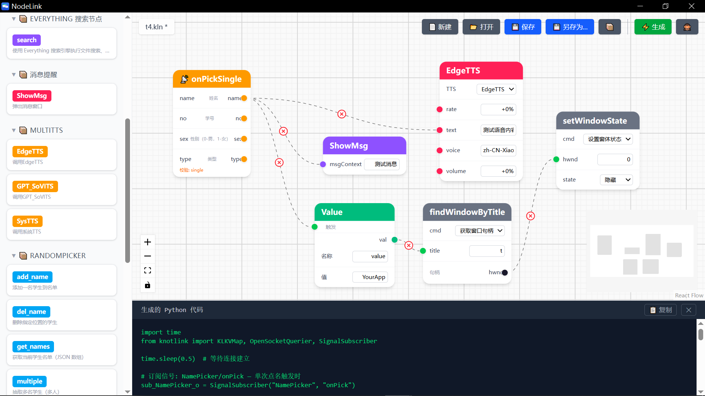
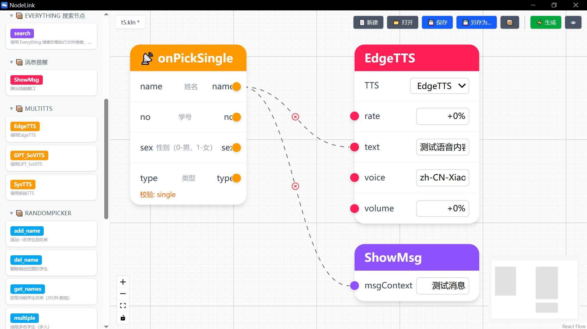
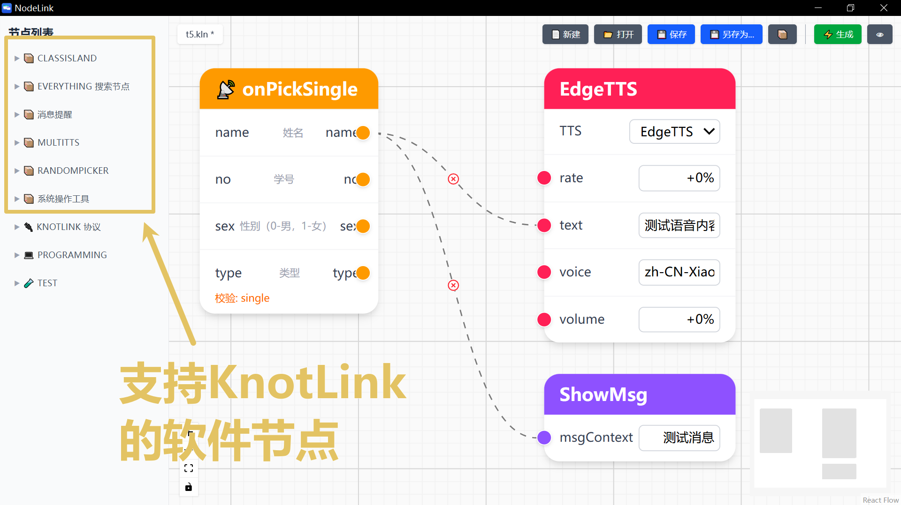
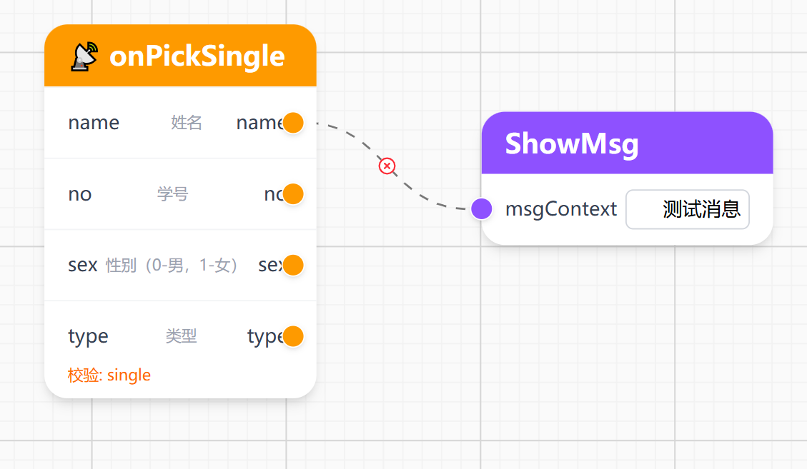
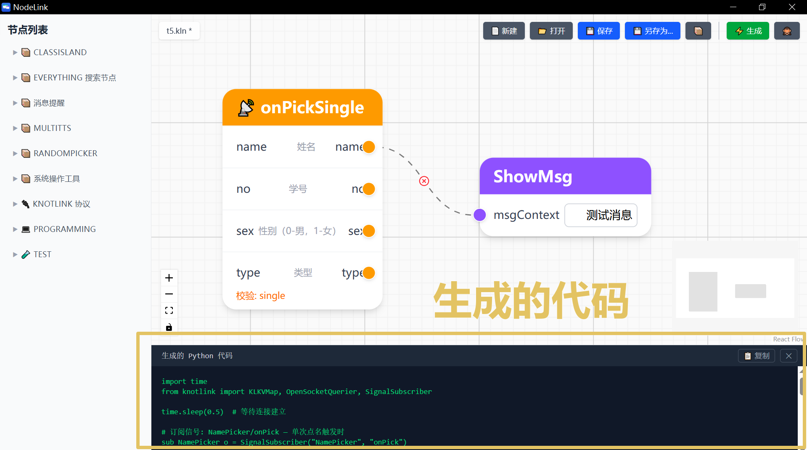
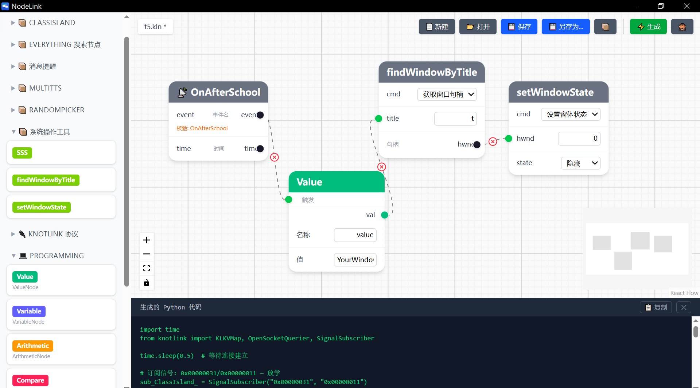

# NodeLink

## 拖拽连线，生成自动化。不需要写代码。

---

NodeLink 是一个可视化自动化编辑器。你把电脑上的软件功能拖到画布上，连上线，它就自动生成能跑的 Python 代码。

点名 + 语音。监控 + 提醒。信号 + 搜索。任何支持 KnotLink 协议的软件都能像积木一样拼接。

---

### 它能做什么

你的电脑上装着各种工具：点名、语音合成、系统监控、消息推送、文件搜索。单独用，每个都只是一把螺丝刀。连起来，它们变成一条流水线。

点名抽出学生 → 语音自动念出名字。CPU 超过阈值 → 屏幕自动弹窗。收到课表信号 → 搜索明天的资料 → 推送到手机。

这些事本来需要你手动操作，一个软件一个软件地打开、复制、粘贴。现在 NodeLink 替你完成。你只需要说清楚一件事：**什么触发什么**。

---

### 怎么用

界面分成三部分：左边是功能面板，中间是画布，右边是工具栏。

功能面板列出了你电脑上所有可用软件的能力。每个能力是一个方块，标着名字和颜色。想看详情？点开折叠区。想用哪个？拖到画布上。

画布上每个方块就是一个节点。节点左边是输入口，右边是输出口。连线的方向就是数据流动的方向。你不需要理解什么是变量、什么是参数、什么是作用域。线连对了，逻辑就对了。

点一下生成按钮，NodeLink 自动写出完整的 Python 脚本。import、连接、参数序列化、返回值解析、异常处理——代码里都有。你可以直接运行，也可以复制出来自己改。

---

### 两种工作方式

自动化有两种运行方式，NodeLink 两种都支持。

**触发式**。当一个事件发生——信号到达、时间到了、数据变了——自动执行一连串动作。就像多米诺骨牌，推倒第一块，后面依次倒下。你在画布上把信号节点连到执行节点，NodeLink 生成的代码会把执行逻辑嵌套在信号的接收回调里。

**请求式**。当你需要时主动调用。问系统"当前 CPU 多少"，系统回答。问点名工具"帮我随机抽一个"，工具给你名字。你把查询节点连到输出节点，代码按顺序执行。

两种模式可以混用。信号触发 → 主动查询 → 结果输出。NodeLink 自动判断你搭的是哪种结构，生成对应的代码。

---

### 和传统自动化有什么不同

传统自动化工具是文本驱动的。写 YAML、写 JSON、写脚本。你盯着配置文件猜哪里不对。

NodeLink 是视觉驱动的。拖拽、连线、生成。你的自动化长什么样，你一眼就看到。

传统自动化的难点不是编排逻辑，而是让软件之间能通信。每个软件有自己的数据格式、调用方式、返回值结构。你让 A 调 B，得先读懂两边的文档。

而支持 KnotLink 协议的软件，天生解决了这个问题。每款软件自带一份能力清单——FuncList.json——里面写明了：我能做什么、需要什么参数、返回什么结果。NodeLink 自动读取这份清单，把它变成可拖拽的节点。A 的输出和 B 的输入自动匹配。不需要你写适配代码。

你只负责规则。协议负责通信。

---

### 透明是你的权利

NodeLink 生成的代码完全是普通的 Python 脚本。你可以阅读每一行。可以修改任何逻辑。可以脱离 NodeLink 单独运行。

数据在你的电脑上处理。不经过任何服务器。不需要注册账号。不需要联网。你的自动化只属于你。

---

### 开源协议

GPLv3。代码公开，永远免费。

由 [Claude Code](https://claude.ai/claude-code) 辅助开发。

[GitHub](https://github.com/KnotLink-Protocol/NodeLink)
