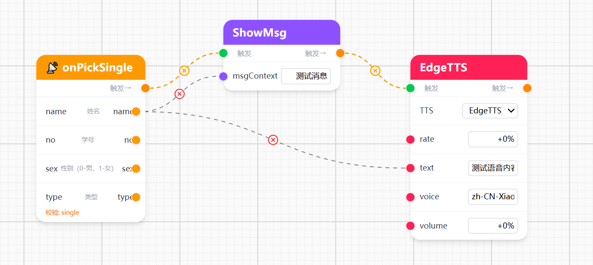
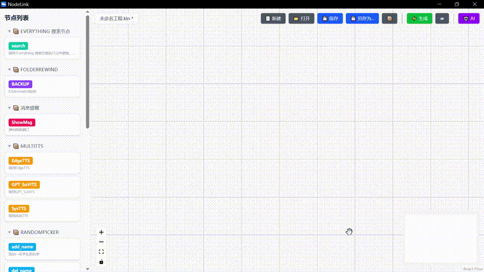
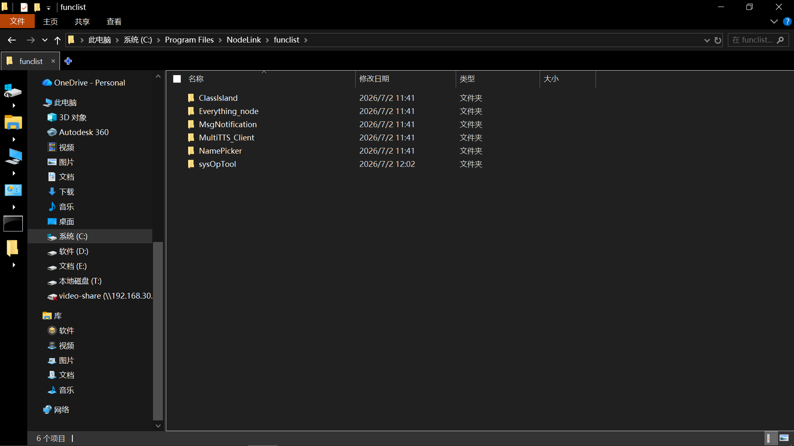
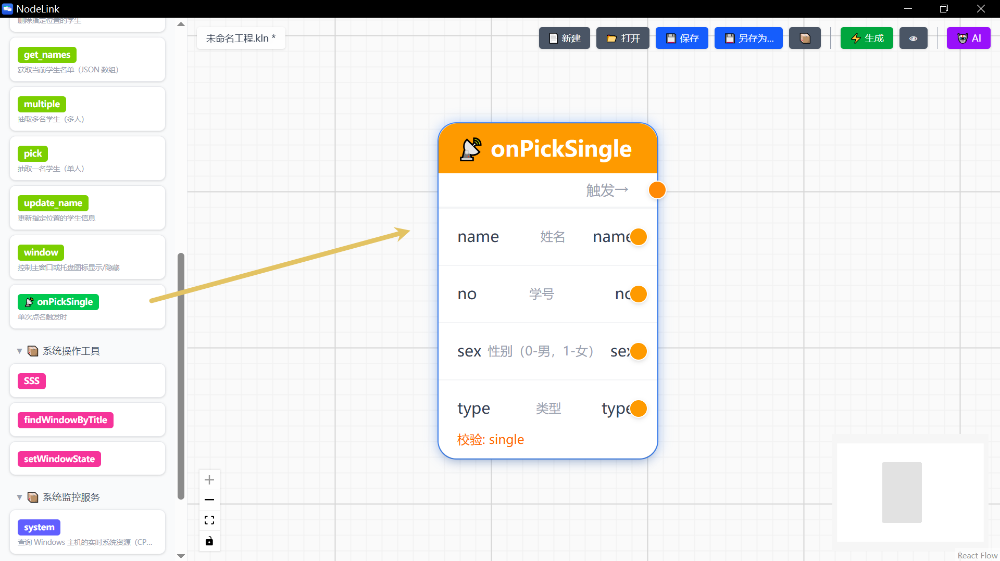
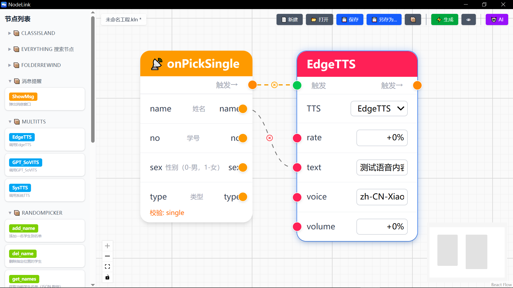
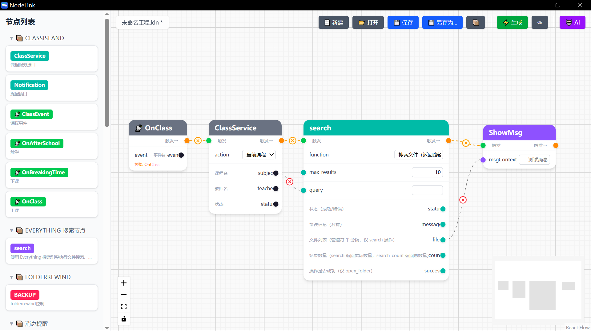

# [自制工具] NodeLink — 拖拽连线，零代码搭自动化

## 引言

今天向大家介绍我开发的一款可视化自动化编辑器：NodeLink。

你有没有遇到过这样的情况：上课想随机点名，点完了还得自己念出名字。或者电脑 CPU 飙高了，想让它自动提醒你。或者收到一条课表信号，想自动搜索明天的资料。

这些事情，本来每件都需要你手动操作。现在用 NodeLink，拖两个方块、连一条线，它就能自动替你完成。

其实网上也有一些自动化工具。但它们大多需要你写配置文件、写脚本、甚至学一门 DSL。配置错了，排查半天。NodeLink 的思路是：你画图，它写代码。你看得见你的自动化长什么样。


NodeLink 界面——浅色画布，左侧功能面板，右侧工具栏

---

## 功能介绍

### 节点面板

打开 NodeLink，左边是功能面板。这里列出了你电脑上所有支持 KnotLink 协议的软件——点名工具、语音合成、系统监控、消息推送、文件搜索……

每个软件的能力都展开在一个折叠区里。想看哪个？点开就行。想用哪个？拖到画布上。


侧边栏展开，显示各个 App 的功能节点

每个节点都是一个带颜色的卡片。顶部有一条**触发栏**——左边是灰色的触发输入口，右边是橙色的触发输出口。标题栏下方才是数据口：输入在左，输出在右。

### 两种连线

NodeLink 最近做了一个重要更新：**把触发流和数据流分开了**。

- 🟠 **橙色虚线** = 触发流。谁触发谁，决定了执行顺序。像多米诺骨牌，A 触发 B，B 触发 C。
- ⚫ **灰色实线** = 数据流。数据怎么传，不影响执行顺序。



触发流和数据流在同一张画布上共存。触发流构成执行的骨架，数据流负责填充参数。代码生成器只看触发流排序，数据流只影响变量引用。

这个设计让自动化逻辑比传统工具清晰得多——你看图就知道"谁先跑、谁传什么"。

如果线连错了，点击线上的 ✕ 就能删掉。

### 生成代码

连线完成后，点一下右上角的 **⚡ 生成** 按钮。底部会展开一个代码面板，里面是完整的 Python 脚本。


生成的代码包含 import、KLKVMap 参数序列化、OpenSocketQuerier 调用、返回值解析

你可以直接复制出来跑，也可以保存为 .kln 工程文件，下次打开继续编辑。NodeLink 生成的代码是透明的——每一行你都能看懂，都能修改。

### 🤖 AI 助手

如果你不想手动搭工作流，现在 NodeLink 右上角多了个 🤖 AI 按钮。

输入一句话：*"随机点名触发后，弹出消息提醒窗口显示名字，在这之后把名字用语音播报出来"*。

AI 会分析你电脑上所有可用的功能节点，自动在画布上放置节点、连线、配置参数。你只需要看一眼对不对，不对就改，对就生成代码。



> 输入一句话 → AI 自动放置节点、连线、生成工作流

AI 支持任何 OpenAI 兼容接口——DeepSeek、OpenAI、OpenRouter、本地 Ollama 都行。你可以把 API 配置写在 exe 旁边的 `ai-config.json` 里，启动自动读取，点一下就能用。

---

## 原理介绍

你可能会好奇：两个软件怎么知道对方要什么数据？

秘密在于 KnotLink 协议。每个支持这个协议的软件都自带一份 FuncList.json 文件，里面写明了：我能做什么、需要什么参数、返回什么结果。NodeLink 启动时自动读取 exe 目录下 funclist 文件夹里的所有 FuncList.json，把它们变成可拖拽的节点。



exe 旁边的 funclist 目录，每个文件夹是一个 App

你新增一个软件？把它的 FuncList.json 放到 funclist 文件夹里，重启 NodeLink，新节点就出现了。不需要改代码，不需要更新软件。

编排好工作流后，NodeLink 按照拓扑顺序遍历画布上的节点，根据每个节点的类型（触发式还是请求式）生成对应的 Python 代码。触发式的节点和它们的下游会自动嵌套在回调函数里；请求式的节点按顺序生成。

---

## 安装与配置

### 下载与安装

从 GitHub Releases 下载 `NodeLink_0.1.0_x64-setup.exe`，双击安装。或者下载便携版压缩包，解压即用。

安装完成后，`.kln` 文件会自动关联 NodeLink。双击 `.kln` 工程文件即可打开，也支持直接拖到 `NodeLink.exe` 图标上。

> 如果 `.kln` 没有自动关联，右键 `register-kln.bat` → 以管理员身份运行。

### 导入功能包（funclist）

NodeLink 的功能节点来自 exe 旁边的 `funclist` 文件夹。

```
NodeLink.exe
└── funclist/
    ├── NamePicker/
    │   └── FuncList.json
    ├── MultiTTS_Client/
    │   └── FuncList.json
    └── ...
```

每个文件夹是一个 App，里面放一个 `FuncList.json`。新增软件时把它丢进去，重启 NodeLink，新节点自动出现。

也可以用 📦 加载功能包 按钮手动导入 `.json` 文件，无需重启。

### 配置 AI 助手

两种方式：

**方式一：配置文件（推荐）**

在 exe 旁边新建 `ai-config.json`：

```json
{
  "endpoint": "https://api.deepseek.com/chat/completions",
  "apiKey": "sk-你的API密钥",
  "model": "deepseek-chat"
}
```

启动 NodeLink 后自动读取，点 🤖 就能用。

**方式二：界面配置**

点 🤖 AI 按钮 → 首次会弹出配置面板 → 填入 Endpoint、API Key、Model → 保存。

支持所有 OpenAI 兼容接口：DeepSeek、OpenAI、OpenRouter、本地 Ollama 等。

---

## 使用示例

### 示例一：点名 + 语音播报

**目标**：随机点名一个学生，电脑自动念出名字。

> 🤖 **AI 提示词**：随机点名触发后，把名字用语音播报出来

**手动搭建**：

① 从左侧面板找到 **NamePicker**，拖出 `pick` 节点。



② 从 **MultiTTS** 拖出 `EdgeTTS` 节点。

③ 连线：pick 的 `name` 输出口 → EdgeTTS 的 `text` 输入口。



④ 点击 **⚡ 生成 Python 代码**。

完成。你什么都没写，一个自动化就搭好了。

### 示例二：信号触发文件搜索

**目标**：收到课表信号后，自动搜索课程资料，把结果发到消息窗口。

> 🤖 **AI 提示词**：收到课表上课信号后，自动搜索与这节课有关的课程资料，然后把文件搜索结果显示在消息窗口



触发流（橙）：信号 → 搜索 → 推送。数据流（灰）：Subject → query，files → msgContext。

NodeLink 自动识别触发流确定执行顺序，数据流不用管方向。

---

## 后记

NodeLink 的诞生源于一个想法：让电脑上的软件不再各自为政。

传统的自动化工具，门槛太高——你得会写脚本、懂 API、调参数。NodeLink 把门槛压到了最低：你会用鼠标拖东西吗？会。那就够了。

当然，NodeLink 还很年轻。功能上可能还有不足，代码生成也可能有没覆盖到的边界情况。如果你在使用中发现了 bug，或者有想要的功能，欢迎在 GitHub 提 Issue，或者在评论区留言。

这个项目用了 Claude Code 辅助开发。从最初的节点编辑器原型，到现在的 funcList 动态加载、Tauri 桌面打包、.kln 工程文件管理，整个过程 AI 参与了架构设计、代码编写和文档撰写。我也从中学到了很多——尤其是"想清楚再写"比"写完了再改"重要得多。

如果你觉得这个工具有用，给个 Star 就是最大的支持。

---

## 资源

- **GitHub**：[https://github.com/KnotLink-Protocol/NodeLink](https://github.com/KnotLink-Protocol/NodeLink)
- **文档**：仓库内 docs/ 目录，8 个模块从入门到构建
- **协议**：GPLv3 开源，免费使用
