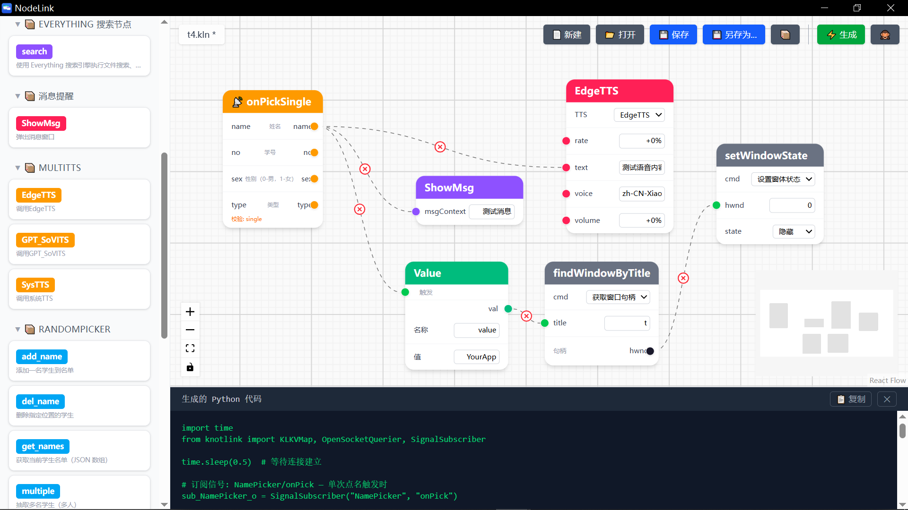

# [即将发布] NodeLink — 可视化自动化编辑器

---

拖两个方块，连一条线，你的自动化就搭好了。

点名 + 语音。监控 + 提醒。信号 + 搜索。不用写一行代码。

---

### 这就是 NodeLink

一个桌面端可视化自动化编辑器。把电脑上的软件功能变成可拖拽的节点，连线即逻辑，一键生成可运行的 Python 代码。

### 和传统工具有什么不同

传统：写脚本、配 YAML、查 API。你看不见你的自动化长什么样。

NodeLink：拖拽、连线、生成。你的自动化看得见、改得动、跑得起来。

### 不只是编辑器

每款支持 KnotLink 协议的软件都自带能力清单。新软件加入，新节点自动出现。不需要适配、不需要配置。软件之间天生能对话。

### 安全 & 透明

生成的 Python 代码完全可读。本地运行。没有云服务。没有数据上传。开箱即用。

---

**即将在 GitHub 开源发布。GPLv3。**

[GitHub](https://github.com/KnotLink-Protocol/NodeLink)
